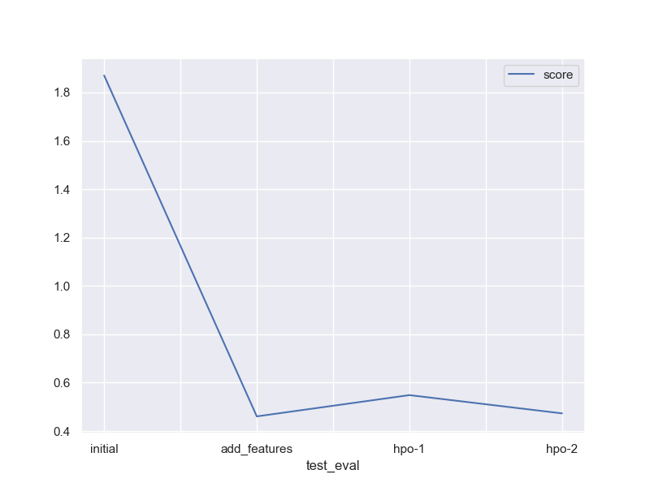

# Report: Predict Bike Sharing Demand with AutoGluon Solution
#### Jyothi K

## Initial Training
### What did you realize when you tried to submit your predictions? What changes were needed to the output of the predictor to submit your results?
I realised I needed to ensure my predictions were non-negative in my second submission. When I first submitted, I had no negative predictions. The subsequent times however, I had a few negative predictions whose values had to be replaced with zero for Kaggle to accept.

### What was the top ranked model that performed?
- The weighted ensemble model L3,curated by the TabularPredictor, which is a combination of the following models and their weights is the best-performing model with validation score = 35.38.
    - *Ensemble Weights config* - 
    {'NeuralNetFastAI_r191_BAG_L2': 0.44, 'ExtraTreesMSE_BAG_L2': 0.16, 'CatBoost_r137_BAG_L2': 0.16, 'CatBoost_r177_BAG_L2': 0.12, 'ExtraTrees_r42_BAG_L2': 0.08, 'CatBoost_BAG_L2': 0.04}
- Other models which performed well were FastAINeuralNetwork, ExtraTrees Boost and Categorical Boost with scores = 35.659, 35.89 and 35.9 respectively.
- The highest kaggle score = 0.4606 is observed in the training with new features round, without hyperparameter optimisation.
## Exploratory data analysis and feature creation
### What did the exploratory analysis find and how did you add additional features?
#### Observations- Histogram
- The `season` seems to have a uniform distribution , with all four seasons being equally likely.
- `season` and `weather` are categorical variables.
- We can observe higher bike rental demands in good weather(1 and 2).
- `Casual` and `registered` are ignored as they are absent in the dataset.
- `Windspeed` is slightly left-skewed.
- `Temp` and `atemp` are normally distributed approximately.
- `Working` and `holiday` are categorical variable with values as yes(1) and no(0).
- People mainly rent bikes only for work, as seen from the `Working` and `holiday` histograms.

#### Observations - Heatmap
- `temp` and `atemp` show a correlation ~ 1, which makes sense since atemp is the feels-like temperature.
- Target `count` decreases with increase in humidity, negative correlation ~ <-0.2
- `holiday` and `workingday` have negative correlation < ~ -0.2
- `windspeed` decreases with increase in `humidity` and has no correlation to `season`, `weather` and `temp`.
- `count` has no correlation with `workingday` , `humidity` and positive correlation with `temp`,`atemp` and`datetime`.

#### Observations-  Histogram with new features
- `year` ,`holiday`,`workingday` , `season` and `weather` are discrete distributions, hence plotting bar charts of these features against the total rentals(target) , `count` , might give insights into the trends.
- `casual` and `registered` are excluded , since they are not available in the test column.
- The remaining continuous variables will be depicted with line plots to observe their changes w.r.t `count`.

#### Observations- Trend Analysis
- Overall, 2012 has higher rental demand, irrespective of other features.
- The `count` increases with increase in `temp`.
- The highest bike rental demand is, 250 approx. for 2012 and 150 approx. in 2011, when the sky is clear and also partly cloudy (1 in `weather`).
- `count` is the highest in fall (3) followed by summer (2), from the `season` plot. This aligns with the `weather` observation; The highest demands are observed by (1) and (2), which have characteristics pertaining to summer and fall.
- Bike rentals decrease with increase in `windspeed`.
- Although in 2011, demand for bikes remained the same for both working days and non-working days, in 2012, slight increase was observed in working days.
- There is a lesser demand for bikes on holidays, which possibly indicates there is more demand on working days or weekends.
- There is a possibility of creating a new feature `weekend` based on the values of `holiday` and `workingday`, when both are 0, `weekend` could be 1 and 0 vice-versa.
- The bike rentals increase with increase in `atemp`, feels -like temperature upto 40 degree, after which it drops, implying that people do not bike when it is too hot. This aligns with `temp` which also observes that the rentals drop from 35 degree.
- There is not much insight into the variation of rentals w.r.t `day` in dates.
- Bikes are rented the least from night to early hours ; Around 8am there is a spike in rentals(450 in 2012) - possible cause might be people commuting to work or school ; The rentals drop in morning to mid-day hours and shoot up again around 4:30- 6 pm,rush hours again. 

- From EDA, I realised I had to extract `datetime` to see the variation `count`, total bike rentals, in yearly,monthly, daily and hourly basis.
- I also noticed that there was not much variation of the bike rental demand in `workingday` and `holiday` w.r.t target `count`. Even both were zero simultaneously, the rental demand was not much affected , which led to the existence of `weekend`, and the creation of feature `day_type` comprising of all three variables.

### How much better did your model perform after adding additional features and why do you think that is?
- The kaggle score improved by 75%, with the RMSE dropping from the initial test score of 1.87 to 0.46 after adding features.
- The increase in features, `day_type`, `hour`,`day`,`month`,`year` , provides more clarity and understanding the seasonality and patterns in the data. 
- A deep understanding of the data leads to good predictions, which is why feature engineering is important.

## Hyper parameter tuning
### How much better did your model preform after trying different hyper parameters?
#### HPO Trial 1
- In the first HPO round, I experimented with the hyperparameters of the models, CatBoost and FastAI Neural Network and set the number of trials to 15.
- I came across a few issues, namely:
    i) I was thrown an exception, "Exception caused NeuralNetFastAI_BAG_L2 to fail during hyperparameter tuning... Skipping this model" and thus, the ensemble model consisted of only different versions of CatBoost for layers and weights.
    ii) Although, the score, 0.55 is higher the initial Kaggle test score 1.87, it is less than the TabularPredictor() score with additional features( and no HPO).
    iii) Since, the number of trials =15, HPO was skipped in a lot of models due to the time constraint = 600.
#### HPO Trial 2    
- In the second HPO round, I tried all the tree-based models( CatBoost, LightGBM, XT,XGB and RF) and K-NN.
- Since, neural networks were ignored in the first round, I dropped the model.
- The top-performing ensemble model, consisted of the weights from the above-mentioned models.
- The time_limit was set to 900 and the number of trials were set to 5.
- The kaggle score increased by 16% from Trial 1 with a score of 0.47.
- This is also closer to the score,0.46, which was produced when feeding the model additional features and not fine-tuning.

### If you were given more time with this dataset, where do you think you would spend more time?
- If given more time, I will spend it on hyperparameter tuning and feature engineering.
- Due to time constraint, I was not able to add additional features categorising temperature (low, medium, high) , humidity(low, high) and windspeed( low, high).
- While training the TabularPredictor() with the requirements given,the weighted ensemble model consisted of all models, from the tree-based to the neural networks.
- I believe the higher score in the 'new features' round compared to the 'HPO( hyperparameter optimization) round' is due to the inclusion of neural networks as a layer in the ensemble model. 
- However, I was unsuccessful in including the neural networks during tuning , and thus could only use the other Tabular models( tree-based and KNN). Hence, if given more time, I will try to figure out what is causing an exception to be thrown when trying to run the FastAINeuralNetwork.

### Create a table with the models you ran, the hyperparameters modified, and the kaggle score.
|model|hpo1|hpo2|hpo3|score|
|--|--|--|--|--|
|initial|prescribed vals|prescribed vals|presets: 'high_quality (auto_stack=True)'|1.87040|			
|add_features|prescribed vals|prescribed vals|preset: 'high_quality (auto_stack=True)'|0.46056|
|hpo|n_trials: 15|(NNFastAI,CAT)|preset:'high_quality (auto_stack=True)'|0.54853
|hpo2|n_trials: 5|(CAT,GBM, XT, XGB & RF,KNN)|preset:'high_quality',time_limit:900|0.47297|

### Create a line plot showing the top model score for the three (or more) training runs during the project.

### Create a line plot showing the top kaggle score for the three (or more) prediction submissions during the project.

## Summary

The best performing model is the Weighted Ensemble with 3 stack levels and comprises of the bagged models,CatBoost and NeuralNetworkFastAI and ExtraTrees, with a validation score of 35.38 and Kaggle score of 0.46056.